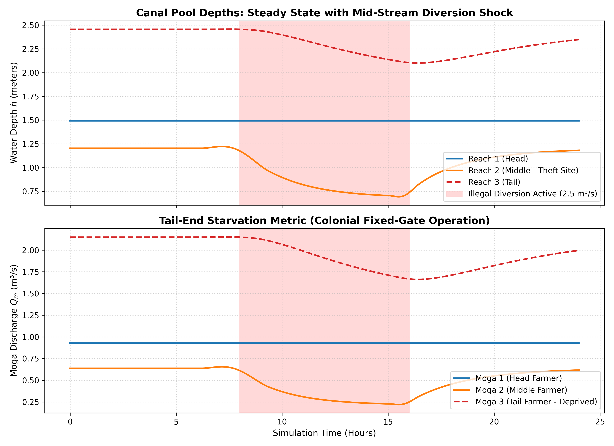

# Indus Canal Digital Twin (Hydrodynamics & Equity Governance)

An open-source 1D hydrodynamic digital twin and decision-support framework modeling the **Indus Basin Irrigation System (IBIS)**. This project simulates unsteady open-channel storage dynamics, quantifies head-to-tail deprivation under unmetered water theft, and models automated telemetry-driven governance.



## Research & Policy Motivation

Under Pakistan's 150-year-old colonial irrigation architecture (*Northern India Canal and Drainage Act of 1873*), water allocation relies on rigid, supply-driven *Warabandi* turns and ungated modular outlets (*mogas*). 

Unmetered diversions and illegal cuts (*kassis*) by upstream users disproportionately starve tail-end smallholders, reducing downstream crop yields and fueling inter-provincial distrust under the 1991 Water Apportionment Accord. This project models these hydraulic realities to evaluate automated, data-driven governance interventions aligned with **UN SDG 6.5 (Integrated Water Resources Management)**.

## System Architecture
... to be added


## Governing Hydraulic Formulations
_ clear typos


1. **Lumped Mass Conservation (Saint-Venant Continuity):**
   $$\frac{dh_i}{dt} = \frac{Q_{\text{in}, i}(t) - Q_{\text{out}, i}(t) - Q_{\text{moga}, i}(t) - Q_{\text{seep}, i}(t) - Q_{\text{theft}, i}(t)}{A_{s, i}(h_i)}$$

2. **Underflow Sluice Gate Orifice Equation:**
   $$Q_{\text{gate}} = C_d \cdot b \cdot w \cdot \sqrt{2 g h_{\text{up}}}$$

3. **Proportional Moga Outlet (Broad-Crested Weir Mechanics):**
   $$Q_{\text{moga}} = C_d \cdot b \cdot \sqrt{\frac{2}{3} g} \cdot (h - h_{\text{sill}})^{1.5}$$

## Baseline Experimental Results

* **Steady-State Inflow:** $14.0\text{ m}^3/\text{s}$
* **Theft Event:** $2.5\text{ m}^3/\text{s}$ unmetered diversion in Reach 2 between $t = 8\text{h}$ and $t = 16\text{h}$.
* **Tail-End Deprivation Index:** **$22.7\%$ supply reduction** to Moga 3, demonstrating how mid-stream extraction collapses downstream head levels without manual gate compensation.

## Repository Setup & Execution

```bash
# Clone and enter directory
git clone [https://github.com/](https://github.com/)<ramday>/indus-canal-twin.git
cd indus-canal-twin

# Setup environment
python -m venv .venv
source .venv/bin/activate  # Windows: .venv\Scripts\activate
pip install -r requirements.txt

# Run unit and integration tests
python -m pytest tests/

# Execute 24-hour simulation
python -m src.simulate